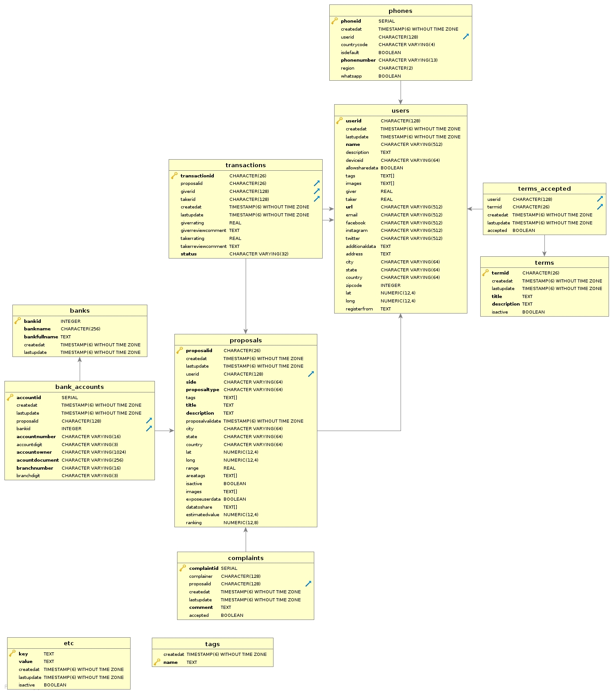

# give-help

É pra sua vida

## Version: 1.0.0

### Security
**APIKeyHeader**  

| oauth2            | *OAuth 2.0*       |
| ----------------- | ----------------- |
| Authorization URL | https://give-help |
| Token URL         | https://give-help |
| Flow              | accessCode        |
| **Scopes**        |                   |
| admin             | Admin scope       |
| user              | Normal User scope |

### /user

#### POST
##### Summary:

Add User

##### Description:

Add a new User

##### Parameters

| Name | Located in | Description                         | Required | Schema               |
| ---- | ---------- | ----------------------------------- | -------- | ---------------------- |
| body | body             | User Object to be added | Yes           | [User](#user) |

##### Responses

| Code | Description         | Schema                |
| ---- | ------------------- | --------------------- |
| 200  | User ID             | [UserID](#userid)     |
| 401  | Authorization Error | [ApiError](#apierror) |
| 500  | Internal Error      | [ApiError](#apierror) |

#### GET
##### Summary:

Get User

##### Description:

Get User by ID

##### Responses

| Code | Description         | Schema                |
| ---- | ------------------- | --------------------- |
| 200  | User                | [User](#user)         |
| 401  | Authorization Error | [ApiError](#apierror) |
| 500  | Internal Error      | [ApiError](#apierror) |

#### PUT
##### Summary:

Update User

##### Description:

Update User By ID

##### Parameters

| Name | Located in | Description | Required | Schema |
| ---- | ---------- | ----------- | -------- | ---- |
| body | body | User Object to be added | Yes | [User](#user) |

##### Responses

| Code | Description         | Schema                |
| ---- | ------------------- | --------------------- |
| 200  | User Updated        |                       |
| 401  | Authorization Error | [ApiError](#apierror) |
| 500  | Internal Error      | [ApiError](#apierror) |

### /transaction

#### POST
##### Summary:

Add a Transaction

##### Description:

Add a New Transaction

##### Parameters

| Name | Located in | Description                    | Required | Schema                      |
| ---- | ---------- | ------------------------------ | -------- | --------------------------- |
| body | body       | Transaction Object to be added | Yes      | [Transaction](#transaction) |

##### Responses

| Code | Description         | Schema                |
| ---- | ------------------- | --------------------- |
| 200  | Transaction ID      | [ID](#id)             |
| 401  | Authorization Error | [ApiError](#apierror) |
| 500  | Internal Error      | [ApiError](#apierror) |

### /transaction/{transaction_id}

#### GET
##### Summary:

Get Transaction

##### Description:

Get Transaction By ID

##### Parameters

| Name           | Located in | Description    | Required | Schema |
| -------------- | ---------- | -------------- | -------- | ------ |
| transaction_id | path       | Transaction ID | Yes      | string |

##### Responses

| Code | Description         | Schema                      |
| ---- | ------------------- | --------------------------- |
| 200  | Transaction         | [Transaction](#transaction) |
| 401  | Authorization Error | [ApiError](#apierror)       |
| 500  | Internal Error      | [ApiError](#apierror)       |

### /transaction/proposal/{proposal_id}

#### GET
##### Summary:

Get Transaction By Proposal

##### Description:

Get Transaction By Proposal ID

##### Parameters

| Name                             | Located in | Description | Required | Schema |
| -------------------------------- | ---------- | ----------- | -------- | ------------ |
| proposal_id | path                         | Proposal ID | Yes                     | string |

##### Responses

| Code | Description                 | Schema                                                   |
| ---- | --------------------------- | -------------------------------------------------------- |
| 200   | Transaction List       | [ [Transaction](#transaction) ] |
| 401   | Authorization Error | [ApiError](#apierror)                     |
| 500   | Internal Error           | [ApiError](#apierror)                     |

### /transaction/user

#### GET
##### Summary:

Get Transaction By User

##### Description:

Get Transaction By User ID

##### Parameters

| Name | Located in | Description | Required | Schema |
| ---- | ---------- | ----------- | -------- | ---- |
| proposal_id | path | Proposal ID | Yes | string |

##### Responses

| Code | Description | Schema |
| ---- | ----------- | ------ |
| 200 | Transaction List | [ [Transaction](#transaction) ] |
| 401 | Authorization Error | [ApiError](#apierror) |
| 500 | Internal Error | [ApiError](#apierror) |

### /transaction/{transaction_id}/giver_review

#### PUT
##### Summary:

Update Transaction with Giver Review

##### Description:

Update Transaction with Giver Review

##### Parameters

| Name                     | Located in | Description       | Required | Schema                       |
| ------------------------ | ---------- | ----------------- | -------- | ------------------------------ |
| transaction_id | path             | Transaction ID | Yes           | string                       |
| body                     | body             | Review                 | Yes           | [Review](#review) |

##### Responses

| Code | Description          | Schema                |
| ---- | -------------------- | --------------------- |
| 200  | Giver Review Created |                       |
| 401  | Authorization Error  | [ApiError](#apierror) |
| 500  | Internal Error       | [ApiError](#apierror) |

### /transaction/{transaction_id}/taker_review

#### PUT
##### Summary:

Update Transaction with Taker Review

##### Description:

Update Transaction with Taker Review

##### Parameters

| Name | Located in | Description | Required | Schema |
| ---- | ---------- | ----------- | -------- | ---- |
| transaction_id | path | Transaction ID | Yes | string |
| body | body | Review | Yes | [Review](#review) |

##### Responses

| Code | Description          | Schema                |
| ---- | -------------------- | --------------------- |
| 200  | Taker Review Created |                       |
| 401  | Authorization Error  | [ApiError](#apierror) |
| 500  | Internal Error       | [ApiError](#apierror) |

### /transaction/{transaction_id}/change_status

#### PUT
##### Summary:

Change Transaction Status

##### Description:

Change Transaction Status

##### Parameters

| Name           | Located in | Description    | Required | Schema                                  |
| -------------- | ---------- | -------------- | -------- | --------------------------------------- |
| transaction_id | path       | Transaction ID | Yes      | string                                  |
| body           | body       | Review         | Yes      | [TransactionStatus](#transactionstatus) |

##### Responses

| Code | Description                | Schema                |
| ---- | -------------------------- | --------------------- |
| 200  | Transaction Status Changed |                       |
| 401  | Authorization Error        | [ApiError](#apierror) |
| 500  | Internal Error             | [ApiError](#apierror) |

### /proposal

#### POST
##### Summary:

Add a Proposal

##### Description:

Add a New Proposal

##### Parameters

| Name | Located in | Description                 | Required | Schema                |
| ---- | ---------- | --------------------------- | -------- | --------------------- |
| body | body       | Proposal Object to be added | Yes      | [Proposal](#proposal) |

##### Responses

| Code | Description         | Schema                |
| ---- | ------------------- | --------------------- |
| 200  | Proposal ID         | [ID](#id)             |
| 401  | Authorization Error | [ApiError](#apierror) |
| 500  | Internal Error      | [ApiError](#apierror) |

### /proposal/{proposal_id}

#### GET
##### Summary:

Get a Proposal

##### Description:

Get a Proposal By ID

##### Parameters

| Name | Located in | Description | Required | Schema |
| ---- | ---------- | ----------- | -------- | ---- |
| proposal_id | path | Proposal ID | Yes | string |

##### Responses

| Code | Description         | Schema                |
| ---- | ------------------- | --------------------- |
| 200  | Proposal            | [Proposal](#proposal) |
| 401  | Authorization Error | [ApiError](#apierror) |
| 500  | Internal Error      | [ApiError](#apierror) |

### /proposal/user

#### GET
##### Summary:

Get Proposal By User

##### Description:

Get Proposal By User ID

##### Responses

| Code | Description                 | Schema                                       |
| ---- | --------------------------- | -------------------------------------------- |
| 200   | Proposal List             | [ [Proposal](#proposal) ] |
| 401   | Authorization Error | [ApiError](#apierror)         |
| 500   | Internal Error           | [ApiError](#apierror)         |

### /proposal/{proposal_id}/share

#### GET
##### Summary:

Get a Proposal

##### Description:

Get a Proposal Data to Share

##### Parameters

| Name | Located in | Description | Required | Schema |
| ---- | ---------- | ----------- | -------- | ---- |
| proposal_id | path | Proposal ID | Yes | string |

##### Responses

| Code | Description         | Schema                          |
| ---- | ------------------- | ------------------------------- |
| 200  | Proposal List       | [ [DataToShare](#datatoshare) ] |
| 401  | Authorization Error | [ApiError](#apierror)           |
| 500  | Internal Error      | [ApiError](#apierror)           |

### /proposal/find

#### POST
##### Summary:

Find a Proposal

##### Description:

Find a Proposal

##### Parameters

| Name | Located in | Description     | Required | Schema            |
| ---- | ---------- | --------------- | -------- | ----------------- |
| body | body       | Proposal Filter | Yes      | [Filter](#filter) |

##### Responses

| Code | Description | Schema |
| ---- | ----------- | ------ |
| 200 | Proposal List | [ [Proposal](#proposal) ] |
| 401 | Authorization Error | [ApiError](#apierror) |
| 500 | Internal Error | [ApiError](#apierror) |

### /proposal/{proposal_id}/change_state/{proposal_state}

#### PUT
##### Summary:

Change Proposal State

##### Description:

Change Proposal State

##### Parameters

| Name           | Located in | Description    | Required | Schema  |
| -------------- | ---------- | -------------- | -------- | ------- |
| proposal_id    | path       | Proposal ID    | Yes      | string  |
| proposal_state | path       | Proposal State | Yes      | boolean |

##### Responses

| Code | Description            | Schema                |
| ---- | ---------------------- | --------------------- |
| 200  | Proposal State Changed |                       |
| 401  | Authorization Error    | [ApiError](#apierror) |
| 500  | Internal Error         | [ApiError](#apierror) |

### /proposal/{proposal_id}/add_tags

#### PUT
##### Summary:

Add Proposal Tags

##### Description:

Add Proposal Tags

##### Parameters

| Name        | Located in | Description   | Required | Schema        |
| ----------- | ---------- | ------------- | -------- | ------------- |
| proposal_id | path       | Proposal ID   | Yes      | string        |
| body        | body       | Proposal Tags | Yes      | [Tags](#tags) |

##### Responses

| Code | Description         | Schema                |
| ---- | ------------------- | --------------------- |
| 200  | Proposal Tags Added |                       |
| 401  | Authorization Error | [ApiError](#apierror) |
| 500  | Internal Error      | [ApiError](#apierror) |

### /proposal/{proposal_id}/add_images

#### PUT
##### Summary:

Add Proposal Images

##### Description:

Add Proposal Images

##### Parameters

| Name        | Located in | Description     | Required | Schema        |
| ----------- | ---------- | --------------- | -------- | ------------- |
| proposal_id | path       | Proposal ID     | Yes      | string        |
| body        | body       | Proposal Images | Yes      | [Tags](#tags) |

##### Responses

| Code | Description           | Schema                |
| ---- | --------------------- | --------------------- |
| 200  | Proposal Images Added |                       |
| 401  | Authorization Error   | [ApiError](#apierror) |
| 500  | Internal Error        | [ApiError](#apierror) |

### /proposal/{proposal_id}/change_validate

#### PUT
##### Summary:

Change Proposal Validate

##### Description:

Change Proposal Validate

##### Parameters

| Name        | Located in | Description                 | Required | Schema                                    |
| ----------- | ---------- | --------------------------- | -------- | ----------------------------------------- |
| proposal_id | path       | Proposal ID                 | Yes      | string                                    |
| body        | body       | Proposal Object to be added | Yes      | [ChangeProposalDate](#changeproposaldate) |

##### Responses

| Code | Description             | Schema                |
| ---- | ----------------------- | --------------------- |
| 200  | Proposal Validate Added |                       |
| 401  | Authorization Error     | [ApiError](#apierror) |
| 500  | Internal Error          | [ApiError](#apierror) |

### /proposal/{proposal_id}/change_text

#### PUT
##### Summary:

Change Proposal Text

##### Description:

Change Proposal Text

##### Parameters

| Name        | Located in | Description                 | Required | Schema                                    |
| ----------- | ---------- | --------------------------- | -------- | ----------------------------------------- |
| proposal_id | path       | Proposal ID                 | Yes      | string                                    |
| body        | body       | Proposal Object to be added | Yes      | [ChangeProposalText](#changeproposaltext) |

##### Responses

| Code | Description         | Schema                |
| ---- | ------------------- | --------------------- |
| 200  | Proposal Text Added |                       |
| 401  | Authorization Error | [ApiError](#apierror) |
| 500  | Internal Error      | [ApiError](#apierror) |

### /category

#### GET
##### Summary:

Get Category

##### Description:

Get Category

##### Responses

| Code | Description         | Schema                |
| ---- | ------------------- | --------------------- |
| 200  | Get Category        | [Tags](#tags)         |
| 401  | Authorization Error | [ApiError](#apierror) |
| 500  | Internal Error      | [ApiError](#apierror) |

### Models

#### ApiError

| Name    | Type   | Description | Required |
| ------- | ------ | ----------- | -------- |
| message | string |             | No       |

#### LoggedUser

| Name     | Type   | Description | Required |
| -------- | ------ | ----------- | -------- |
| provider | string |             | Yes      |
| email    | string |             | Yes      |
| name     | string |             | Yes      |
| picture  | string |             | Yes      |
| user_id  | string |             | Yes      |

#### ChangeProposalText

| Name        | Type   | Description | Required |
| ----------- | ------ | ----------- | -------- |
| title       | string |             | Yes      |
| description | string |             | Yes      |

#### ChangeProposalDate

| Name | Type     | Description | Required |
| ---- | -------- | ----------- | -------- |
| date | dateTime |             | Yes      |

#### User

| Name             | Type                      | Description | Required |
| ---------------- | ------------------------- | ----------- | -------- |
| user_id          | [UserID](#userid)         |             | No       |
| created_at       | dateTime                  |             | No       |
| last_update      | dateTime                  |             | No       |
| name             | string                    |             | No       |
| description      | string                    |             | No       |
| device_id        | string                    |             | No       |
| location         | [Location](#location)     |             | No       |
| contact          | [Contact](#contact)       |             | No       |
| allow_share_data | boolean                   |             | No       |
| images           | [ string ]                |             | No       |
| reputation       | [Reputation](#reputation) |             | No       |
| tags             | [Tags](#tags)             |             | No       |
| register_from    | string                    |             | No       |

#### Contact

| Name            | Type                | Description | Required |
| --------------- | ------------------- | ----------- | -------- |
| phones          | [ [Phone](#phone) ] |             | No       |
| email           | string              |             | No       |
| instagram       | string              |             | No       |
| facebook        | string              |             | No       |
| google          | string              |             | No       |
| url             | string              |             | No       |
| additional_data | string              |             | No       |

#### Phone

| Name         | Type    | Description | Required |
| ------------ | ------- | ----------- | -------- |
| region       | string  |             | No       |
| phone_number | string  |             | No       |
| country_code | string  |             | No       |
| whatsapp     | boolean |             | No       |
| is_default   | boolean |             | No       |

#### Location

| Name     | Type             | Description | Required |
| -------- | ---------------- | ----------- | -------- |
| zip_code | integer          |             | No       |
| address  | string           |             | No       |
| city     | string           |             | No       |
| state    | string           |             | No       |
| country  | string           |             | No       |
| lat      | number (float64) |             | No       |
| long     | number (float64) |             | No       |

#### Reputation

| Name  | Type             | Description | Required |
| ----- | ---------------- | ----------- | -------- |
| giver | number (float64) |             | No       |
| taker | number (float64) |             | No       |

#### Proposal

| Name              | Type                            | Description | Required |
| ----------------- | ------------------------------- | ----------- | -------- |
| proposal_id       | [ID](#id)                       |             | No       |
| created_at        | dateTime                        |             | No       |
| last_update       | dateTime                        |             | No       |
| side              | [Side](#side)                   |             | No       |
| proposal_type     | [Type](#type)                   |             | No       |
| user_id           | [UserID](#userid)               |             | No       |
| tags              | [Tags](#tags)                   |             | No       |
| title             | string                          |             | No       |
| description       | string                          |             | No       |
| proposal_validate | dateTime                        |             | No       |
| target_area       | [Area](#area)                   |             | No       |
| is_active         | boolean                         |             | No       |
| images            | [ string ]                      |             | No       |
| expose_user_data  | boolean                         |             | No       |
| data_to_share     | [ [DataToShare](#datatoshare) ] |             | No       |
| estimated_value   | number (float64)                |             | No       |

#### Filter

| Name           | Type              | Description | Required |
| -------------- | ----------------- | ----------- | -------- |
| tags           | [Tags](#tags)     |             | No       |
| target_area    | [Area](#area)     |             | No       |
| side           | [Side](#side)     |             | No       |
| proposal_types | [ [Type](#type) ] |             | No       |
| description    | string            |             | No       |
| max_value      | number (float64)  |             | No       |
| min_value      | number (float64)  |             | No       |

#### Transaction

| Name           | Type                                    | Description | Required |
| -------------- | --------------------------------------- | ----------- | -------- |
| transaction_id | [ID](#id)                               |             | No       |
| proposal_id    | [ID](#id)                               |             | No       |
| giver_id       | [ID](#id)                               |             | No       |
| taker_id       | [ID](#id)                               |             | No       |
| created_at     | dateTime                                |             | No       |
| last_update    | dateTime                                |             | No       |
| giver_review   | [Review](#review)                       |             | No       |
| taker_review   | [Review](#review)                       |             | No       |
| status         | [TransactionStatus](#transactionstatus) |             | No       |

#### Side

| Name | Type   | Description | Required |
| ---- | ------ | ----------- | -------- |
| Side | string |             |          |

#### Type

| Name | Type   | Description | Required |
| ---- | ------ | ----------- | -------- |
| Type | string |             |          |

#### Area

| Name      | Type             | Description | Required |
| --------- | ---------------- | ----------- | -------- |
| lat       | number (float64) |             | No       |
| long      | number (float64) |             | No       |
| range     | number (float64) |             | No       |
| area_tags | [Tags](#tags)    |             | No       |

#### TransactionStatus

| Name              | Type   | Description | Required |
| ----------------- | ------ | ----------- | -------- |
| TransactionStatus | string |             |          |

#### Review

| Name    | Type    | Description | Required |
| ------- | ------- | ----------- | -------- |
| rating  | integer |             | No       |
| comment | string  |             | No       |

#### Tags

| Name | Type  | Description | Required |
| ---- | ----- | ----------- | -------- |
| Tags | array |             |          |

#### DataToShare

| Name        | Type   | Description | Required |
| ----------- | ------ | ----------- | -------- |
| DataToShare | string |             |          |

#### UserID

| Name   | Type   | Description | Required |
| ------ | ------ | ----------- | -------- |
| UserID | string |             |          |

#### ID

| Name | Type   | Description | Required |
| ---- | ------ | ----------- | -------- |
| ID   | string |             |          |

## Cloud infrastructure model

## Database ER

